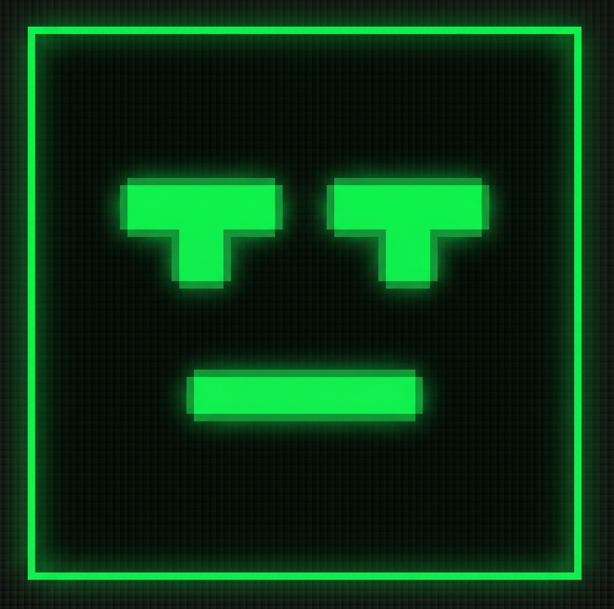

<p align="center">
  
</p>

<h1 align="center">MoodTris</h1>

<p align="center">
  <strong><em>Emotion-aware Tetris</em> — the game that watches your face and adjusts the difficulty based on how you're feeling.</strong>
</p>

<p align="center">
  
  
  
  
  
</p>

---

## What is MoodTris?

MoodTris is a full-featured Tetris clone built with Next.js that uses your webcam and AI-powered facial expression recognition to dynamically adjust the game's difficulty in real time. Stressed out? The game slows down as a mercy. Zoning out? It speeds up to re-engage you. Think you've got what it takes? Sign in and compete on the global leaderboard.

---

## Features

- **Classic Tetris gameplay** — all 7 tetrominoes, ghost piece, hold mechanic, hard drop, soft drop, wall kicks
- **Emotion-aware difficulty** — optional webcam-based facial expression detection via `face-api.js`
  - 😰 **Stressed** (fearful + surprised + angry) → level drops by 1
  - 😑 **Disengaged** (sad + disgusted) → level bumps up by 1
  - 😊 **Calm** (neutral + happy) → level stays the same
- **Live emotion dashboard** — real-time bar graph of all 7 emotion scores grouped by their effect on difficulty
- **Camera preview** — mirrored webcam feed shown in the sidebar when mood toggle is on
- **Global leaderboard** — top 10 all-time highest scores, shown at game over; your entry is highlighted so you always know where you stand
- **Score saving** — sign in to automatically save your score to the leaderboard after every game
- **User authentication** — register and sign in via Supabase Auth; scores are tied to your username
- **DAS (Delayed Auto Shift)** — smooth, responsive key movement independent of OS repeat rate
- **Resume countdown** — 3-second countdown before the game resumes after pausing
- **Retro CRT aesthetic** — scanlines, phosphor flicker, green glow, pixel fonts

---

## Getting Started

### Prerequisites

- Node.js 18+
- pnpm
- [Supabase](https://supabase.com)

### Installation

```bash
git clone https://github.com/yourusername/moodtris.git
cd moodtris
pnpm install
```

### Environment Variables

Create a `.env.local` file in the project root:

```env
NEXT_PUBLIC_SUPABASE_URL=your_supabase_project_url
NEXT_PUBLIC_SUPABASE_ANON_KEY=your_supabase_anon_key
```

### Supabase Setup

Run the following SQL in your Supabase **SQL Editor** to create the required tables and access policies:

```sql
-- Profiles table
CREATE TABLE profiles (
  id UUID PRIMARY KEY REFERENCES auth.users(id) ON DELETE CASCADE,
  username TEXT NOT NULL UNIQUE,
  created_at TIMESTAMPTZ DEFAULT NOW()
);

-- Scores table
CREATE TABLE scores (
  id UUID PRIMARY KEY DEFAULT gen_random_uuid(),
  user_id UUID NOT NULL REFERENCES profiles(id) ON DELETE CASCADE,
  username TEXT NOT NULL,
  score INTEGER NOT NULL,
  lines INTEGER NOT NULL,
  level INTEGER NOT NULL,
  created_at TIMESTAMPTZ DEFAULT NOW()
);

-- Allow anyone to read scores (public leaderboard)
CREATE POLICY "public leaderboard read"
ON scores FOR SELECT USING (true);

-- Allow authenticated users to insert their own scores
CREATE POLICY "users insert own scores"
ON scores FOR INSERT
WITH CHECK (auth.uid() = user_id);

ALTER TABLE scores ENABLE ROW LEVEL SECURITY;
```

### Download Model Weights

MoodTris uses `face-api.js` for emotion detection. You need to download the model weights before the mood feature will work. Run this in PowerShell from your project root:

```powershell
New-Item -ItemType Directory -Force -Path public/models

$base = "https://cdn.jsdelivr.net/gh/justadudewhohacks/face-api.js/weights"
$files = @(
  "tiny_face_detector_model-weights_manifest.json",
  "tiny_face_detector_model-shard1",
  "face_expression_model-weights_manifest.json",
  "face_expression_model-shard1"
)
foreach ($f in $files) {
  Invoke-WebRequest -Uri "$base/$f" -OutFile "public/models/$f"
  Write-Host "Downloaded $f"
}
```

### Run the Development Server

```bash
pnpm dev
```

Open [http://localhost:3000](http://localhost:3000) in your browser.

---

## Controls

| Key                | Action           |
| ------------------ | ---------------- |
| `←` `→`            | Move piece       |
| `↑`                | Rotate clockwise |
| `↓`                | Soft drop        |
| `Space`            | Hard drop        |
| `C` / `Left Shift` | Hold piece       |
| `Esc`              | Pause / Resume   |

---

## Scoring

| Lines Cleared    | Points      |
| ---------------- | ----------- |
| 1 line           | 100 × level |
| 2 lines          | 300 × level |
| 3 lines          | 500 × level |
| 4 lines (Tetris) | 800 × level |

Level increases every **10 lines** cleared, which also speeds up the auto drop. The mood system can temporarily nudge the level up or down on top of this.

---

## Project Structure

```
moodtris/
├── app/
│   ├── globals.css             # CRT retro styles, fonts, animations
│   ├── layout.tsx              # Root layout + metadata
│   └── page.tsx                # Entry point, renders TetrisGame
├── components/
│   ├── Tetris.tsx              # Main game component (canvas, game loop, UI overlays)
│   ├── Leaderboard.tsx         # Top 10 leaderboard panel (shown at game over)
│   ├── AuthModal.tsx           # Sign in / register modal
│   └── UserHUD.tsx             # Top-right player status + sign out button
├── constants/
│   └── tetris.ts               # Board dimensions, colors, tetromino shapes
├── hooks/
│   ├── useTetris.ts            # Core game logic: board, pieces, game loop, DAS
│   ├── useEmotionDetection.ts  # Webcam + face-api.js emotion detection
│   ├── useLeaderboard.ts       # Fetches top 10 scores from Supabase
│   └── useAuth.ts              # Supabase auth: sign up, sign in, sign out, score saving
├── lib/
│   └── supabase.ts             # Supabase client + Profile/Score types
├── utils/
│   ├── tetris-engine.ts        # Pure logic: collision, rotation, wall kicks, bag gen
│   └── tetris-renderer.ts      # Canvas rendering: board, hold, next-piece previews
└── public/
    └── models/                 # face-api.js model weights (downloaded separately)
```

---

## Tech Stack

- **[Next.js 16](https://nextjs.org/)** — React framework
- **[React 19](https://react.dev/)** — UI
- **[TypeScript](https://www.typescriptlang.org/)** — Type safety
- **[Tailwind CSS v4](https://tailwindcss.com/)** — Styling
- **[Supabase](https://supabase.com)** — Authentication, database, and leaderboard backend
- **[face-api.js](https://github.com/justadudewhohacks/face-api.js)** — In-browser facial expression recognition

---

## Privacy

The mood feature is **opt-in only** — the camera is never accessed unless you explicitly toggle it on. All emotion detection runs **entirely in your browser** using TensorFlow.js. No video data is ever sent to a server.
